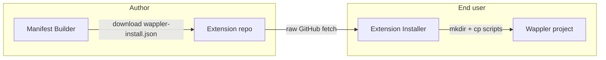

# Manifest Builder — proposed authoring tool

**Status:** Live on [Mr Cheese](https://www.mrcheese.co.uk/extensions/manifest-builder) (`/extensions/manifest-builder`)  
**Companion to:** [PROPOSAL.md](./PROPOSAL.md) · [SCHEMA.md](./SCHEMA.md)

---

## Summary

A **browser-based wizard** that helps extension authors create a valid **`wappler-install.json`** without hand-editing JSON or reading the full schema doc.

Same philosophy as the Mr Cheese **Extension Installer** — runs in the browser, generates output the user copies or downloads. No account, no server-side storage of their extension data.

**Proposed URL on Mr Cheese:** `/extensions/manifest-builder`  
(linked from the extension catalog and from this standard’s README)

---

## Why this matters

| Without a builder | With a builder |
|-----------------|----------------|
| Author reads SCHEMA.md and copies an example | Guided form with Wappler path presets |
| Easy to typo `dest` paths or forget duplicate `lib/modules` copy | Templates for common Server Connect / App Connect layouts |
| JSON syntax errors | Live validation against `wappler-install.schema.json` |
| Low adoption of the standard | Lower barrier → more community repos ship a manifest |

The standard only helps if authors actually **create** the file. A builder is the friendly on-ramp; the installer is the consumer on the other side.

---

## Who it’s for

1. **Mr Cheese** — refresh manifests when files change (dogfood the tool).  
2. **Community authors** — anyone shipping a Git-born Wappler extension.  
3. **Future you** — new extension repos start from the builder export, not a blank JSON file.

Not aimed at Wappler npm-only extensions unless they *also* document a manual Git install path.

---

## Recommended UX (wizard steps)

### Step 1 — Extension identity

| Field | Input |
|-------|--------|
| Display name | Text — e.g. `My Cool Module` |
| ID slug | Auto from name (editable) — e.g. `my-cool-module` |
| Version | Text — optional semver |
| Suggested clone folder | Text — e.g. `Wappler-My-Cool-Module` |
| README URL | Optional — defaults to GitHub `#installation` if repo URL set later |

### Step 2 — Layers

Checkboxes (same as installer):

- Server Connect  
- App Connect  
- Both  

Shows only the sections that apply.

### Step 3 — Copy map (per layer)

Interactive table:

| Source (repo path) | Destination (project path) | Actions |
|--------------------|----------------------------|---------|
| `mymodule.js` | `lib/modules/mymodule.js` | Remove |

**Destination paths** are always **relative to the Wappler project root** — the folder with `app/`, `lib/`, and `extensions/`. Install tools assume the user runs `mkdir` and `cp` from that directory.

**Helpers:**

- **Add row** — blank src/dest  
- **Add Server Connect module pair** — one click adds the usual triple:
  - `*.hjson` → `extensions/server_connect/modules/`
  - `*.js` → `lib/modules/`
  - `*.js` → `extensions/server_connect/modules/`
- **Destination presets** (dropdown on dest field):
  - `extensions/server_connect/modules/`
  - `extensions/server_connect/routes/`
  - `lib/modules/`
  - `extensions/app_connect/components/`
  - `public/js/`
  - `public/css/`
  - `public/`
- **Pick file basename** — user types module name; tool suggests standard dests

**Auto-derived folders:** `directories[]` computed from unique parent paths of all `dest` values (user can add extras manually).

### Step 4 — Post-install notes

- Multi-line list editor (add / remove / reorder bullets)  
- **Snippets** one-click insert:
  - “Quit Wappler completely and restart.”
  - “Set env vars in Wappler — see README.”
  - “Add App Connect Browser component; set ID to `browser`.”
  - “Or install via npm / Project Updater — see README.”

### Step 5 — Preview & export

- Syntax-highlighted JSON preview (read-only, updates live)  
- Validation panel — errors/warnings from JSON Schema  
- **Copy JSON** button  
- **Download `wappler-install.json`** button  
- Short checklist:
  1. Save file to your repo root  
  2. Commit and push  
  3. Link from README Installation section  
  4. Test with Mr Cheese Extension Installer (when manifest fetch is live)

Optional: **Import JSON** — paste existing manifest to edit (round-trip).

---

## Technical approach (Mr Cheese website)

Reuse patterns from the existing installer:

| Piece | Approach |
|-------|----------|
| Page | New EJS view + route e.g. `/extensions/manifest-builder` |
| JS | `mc-manifest-builder.js` — form state → JSON object |
| CSS | Extend `wdp-landing.css` (shared wizard / code block styles) |
| Validation | Load `wappler-install.schema.json` in browser (e.g. Ajv) or hand-rolled checks for v1 |
| Storage | None server-side; optional `localStorage` draft so refresh doesn’t lose work |
| Auth | None required |

**No extension repo access** — the builder does not scan GitHub. Author types paths manually (or imports JSON). A future enhancement could fetch repo file list via GitHub API if user pastes a URL (optional, rate limits).

---

## Relationship to other tools

| Tool | Direction | Output |
|------|-----------|--------|
| **Manifest Builder** | Author → standard | `wappler-install.json` |
| **Extension Installer** | Standard → user | bash scripts + notes |
| **JSON Schema** | Both | validation |

---

## Scope for v1 (keep it simple)

**In scope:**

- Full schema v1 coverage  
- Server / App / both sections  
- Copy table + note snippets + export  
- Schema validation messages  

**Out of scope for v1 (later):**

- GitHub repo file browser  
- Parse README `cp` lines into rows  
- CLI (`npx wappler-install-init`)  
- Publish to npm from the builder  

---

## Placement on Mr Cheese

Suggested nav:

- **Extensions catalog** (`/extensions`) — card: “Create install manifest”  
- **Extension Installer** (`/extensions/install`) — footer link: “Publishing an extension? Build a manifest”  
- **Git-Extension-manifest-Standard** docs (when published) — link back to live builder  

Positions Mr Cheese as the hub for Git-born extension tooling without locking the standard to one domain — the JSON format remains portable.

---

## Adoption impact

A public builder **increases the chance the standard spreads** beyond Mr Cheese repos:

1. Author finds standard docs or installer “missing manifest” hint  
2. Opens builder, fills form in ~5 minutes  
3. Commits `wappler-install.json`  
4. Any installer that implements fetch works immediately  

Mr Cheese benefits from goodwill and traffic; the format stays open.

---

## Risks and mitigations

| Risk | Mitigation |
|------|------------|
| Builder generates wrong dest paths | Presets + SC module pair template; validation warns on unusual paths |
| Authors skip README | Builder reminds to link README; manifest doesn’t replace docs |
| Drift between repo files and manifest | Author responsibility; future: CI job validates `src` files exist |
| Feature creep | Ship v1 export-only; iterate on import/GitHub later |

---

## Proposed rollout order

1. **Documentation** (this file) — you review ✅  
2. **Approve standard** — schema + examples in extension repos *(only when you prompt)*  
3. **Build Manifest Builder** on mrCheese — standalone page, no installer coupling required  
4. **Installer manifest fetch** — consumes manifests authors created with the builder  
5. **Optional:** host `wappler-install.schema.json` on mrcheese.co.uk for external validators  

Building the builder **before** or **in parallel with** installer fetch both work. Builder first helps you author Mr Cheese manifests manually without editing JSON.

---

## Open questions

1. **URL** — `/extensions/manifest-builder` vs `/extensions/create-manifest`?  
2. **Draft save** — `localStorage` auto-save on by default?  
3. **Branding** — “Mr Cheese Manifest Builder” vs neutral “Wappler Install Manifest Builder”?  
4. **Open source** — ship builder JS in mrCheese only, or later extract to `Git-Extension-manifest-Standard` repo as static demo?  

---

## Decision checklist (for you)

- [ ] Approve manifest builder as part of the standard ecosystem  
- [ ] Approve proposed UX / steps  
- [ ] Approve mrCheese hosting when ready to implement  
- [ ] **Extension repos** — still no changes until you explicitly prompt Phase 2  

When you want implementation, say: **“build the manifest builder on mrCheese”** (website only) or **“add manifests to extension repos”** (repos only) — we’ll keep those separate unless you ask for both.
