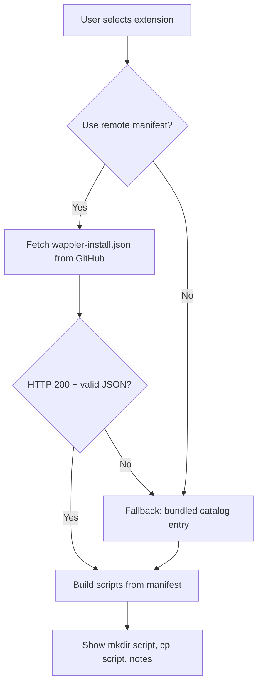

# Proposal: `wappler-install.json` for Git-born Wappler extensions

**Version:** Draft 1  
**Date:** June 2026  
**Status:** Proposal — not yet adopted in extension repos or the Mr Cheese installer

---

## Summary

Define a **standard filename and JSON schema** — `wappler-install.json` at the repository root — so Git-distributed Wappler extensions ship machine-readable install instructions alongside their README.

Tools that understand the standard can generate terminal scripts (`git clone`, `mkdir -p`, `cp`) and post-install checklists without maintaining a duplicate copy of every extension’s file map on a website.

---

## The problem today

### Git-born extensions

Many Wappler extensions (including Mr Cheese’s) are distributed as:

1. Public Git repository  
2. User clones or downloads  
3. User copies files into `extensions/`, `lib/modules/`, `public/`, etc.  
4. User restarts Wappler  

Install steps are documented in **README prose** — great for humans, awkward for tools.

### Duplication on Mr Cheese

The [Extension Installer wizard](https://www.mrcheese.co.uk/extensions/install) reads a **central catalog**:

`mrCheese/public/data/extension-manifests.json`

That file repeats, for each extension:

- GitHub URL and suggested clone folder name  
- Every `cp` source and destination  
- Folders to create  
- Post-install notes (env vars, Browser component, restart Wappler, etc.)

When an extension adds a new `.hjson` or changes a path, someone must update **both** the repo README **and** the website catalog. They can drift apart.

### Wappler’s npm path is different

Wappler’s documented distribution for many App Connect extensions uses:

- `package.json` with `wappler-extension` keyword  
- npm publish or `file:../` local install  
- Project Updater in the IDE  

That path does not describe **manual copy maps** for Server Connect modules, routes hooks, or flat Git repos. This standard fills that gap — it complements npm, it does not replace it.

---

## Proposal

### One file per extension repo

| Item | Value |
|------|--------|
| **Filename** | `wappler-install.json` |
| **Location** | Repository root (same level as `README.md`) |
| **Format** | JSON, UTF-8 |
| **Schema version** | Integer field `"schema": 1` |

Authors commit this file with the extension. It is versioned with the code it describes.

### Split responsibilities

| Layer | Where it lives | Contains |
|-------|----------------|----------|
| **Install manifest** | Extension repo | Copy map, directories, install notes |
| **Catalog index** | Mr Cheese (or any aggregator) | Id, display name, GitHub URL, flags for UI — *optional* thin index |
| **Human docs** | `README.md` | Examples, env vars, troubleshooting, architecture |
| **Package identity** | `package.json` | npm name, version, `wappler` block |

The manifest is the **single source of truth for install automation**. README should link to it (“Install manifest: `wappler-install.json`”) but need not duplicate every `cp` line if the manifest is complete.

---

## How it works

### For extension authors

1. Create `wappler-install.json` following [SCHEMA.md](./SCHEMA.md).  
2. Keep it accurate when files move or new steps are added.  
3. Tag releases — tools may fetch manifest from a specific tag.  
4. Mention the file in README under Installation.

### For install tools (conceptual flow)



**Fetch URL pattern** (default branch, default path):

```
https://raw.githubusercontent.com/{owner}/{repo}/{ref}/wappler-install.json
```

- `{ref}` — typically `main`, or a release tag (e.g. `v1.2.12`) when the tool supports version pinning.  
- Custom repos: derive `owner` / `repo` from the user’s GitHub URL.

**Validation:** Parse JSON, check `schema` is supported, require at least one of `serverConnect` / `appConnect` when the user’s install type matches.

**Generation** (same as today’s Mr Cheese wizard):

- `directories[]` → `mkdir -p` lines  
- `copy[]` → `cp` lines (source relative to clone root, dest relative to Wappler project root)  
- `notes[]` → “After copy” bullet list  
- `cloneDir` → suggested folder name in `git clone` command  

The browser **still does not write files** — it only generates commands the user runs locally.

### Mr Cheese installer behaviour (live)

| Feature | Behaviour |
|---------|-----------|
| **Toggle** | “Use install manifest from repository” (on by default when available) |
| **Fetch** | When the user reaches the commands step (or changes extension), try raw GitHub URL |
| **Success** | Use manifest for copy map, folders, notes; show indicator “Using repo manifest” |
| **Failure** | Network error, 404, invalid JSON → fall back to `extension-manifests.json` on mrCheese; show “Using bundled catalog” |
| **Custom GitHub URL** | If user enters a URL and manifest exists, use it without a central catalog entry |
| **Scripts** | User runs from their **open Wappler project root**: relative `mkdir -p`, clone repo alongside project, relative `cp` — no `PROJECT=` variable |
| **Caching** | In-memory cache per repo while the wizard is open |

The bundled catalog becomes a **fallback and discovery index**, not the long-term duplicate of every `copy` array.

---

## Goals

1. **Single source of truth** — install paths live in the repo that ships the files.  
2. **Tool-agnostic** — any client can implement the same fetch + generate logic.  
3. **Simple schema** — small enough to author by hand; no build step required.  
4. **Backward compatible** — tools work without the file (README + generic placeholders).  
5. **Community-friendly** — any Git-born author can adopt without Mr Cheese approval.

## Non-goals

1. Replacing Wappler Project Updater or IDE extension registration.  
2. Automating Wappler restart or file writes from the browser.  
3. Describing database migrations, SQL seeds, or env var *values* (only *pointers* in notes).  
4. Supporting non–Node/Wappler project layouts in schema v1.

---

## Relationship to other files

### `package.json`

Keep using `package.json` for npm identity. The install manifest does not duplicate `name` / `version` for npm — but may include `version` for display and for matching a git tag.

Optional cross-reference:

```json
"wappler": {
  "module": "pushit",
  "installManifest": "wappler-install.json"
}
```

*Optional in v1 — not required for the standard to work.*

### `README.md`

README remains the full guide. Recommended Installation section structure:

1. Link to automated install (Mr Cheese wizard) if applicable  
2. “Or manual install — see `wappler-install.json` or run:”  
3. Env vars, examples, troubleshooting  

### Central catalog (`extension-manifests.json`)

After adoption, slim down each entry to something like:

```json
{
  "id": "push-it",
  "name": "PuSH-IT",
  "github": "https://github.com/MrCheeseGit/Wappler-PuSH-IT-Extension",
  "hasServerConnect": true,
  "hasAppConnect": true,
  "installManifest": "wappler-install.json",
  "installManifestRef": "main"
}
```

Full `copy` / `notes` blocks move into each repo’s `wappler-install.json`. Catalog entries remain for dropdown population and offline fallback.

---

## Versioning

### Schema version (`schema` field)

- **Integer**, starting at `1`.  
- Breaking changes increment schema (tools reject unknown versions or use best-effort fallback).  
- Document changes in this repo’s CHANGELOG when schema bumps.

### Extension version (`version` field)

- Optional string, semver recommended (e.g. `"1.2.12"`).  
- Should match `package.json` / git tag when possible.  
- Tools *may* fetch `.../v1.2.12/wappler-install.json` when user picks a release.

---

## Adoption path (Mr Cheese)

### Phase 1 — Documentation (current)

- [x] Proposal and schema in `Git-Extension-manifest-Standard/`  
- [ ] You review and approve or request changes  
- [ ] **No extension repo changes until you prompt**

### Phase 2 — Extension repos

- Add `wappler-install.json` to each MrCheeseGit extension  
- Trim duplicated install tables from README where the manifest is authoritative  
- Optional: GitHub topic `wappler-install-manifest`

### Phase 3 — Mr Cheese installer

- Fetch manifest when toggle enabled and file exists  
- Fallback to bundled catalog  
- UI indicator for manifest source  

### Phase 4 — Manifest Builder (mrCheese)

- Browser wizard for **authors** — create and download `wappler-install.json`  
- Live JSON Schema validation, Wappler path presets, note snippets  
- Proposed route: `/extensions/manifest-builder`  
- Full UX spec: [MANIFEST-BUILDER.md](./MANIFEST-BUILDER.md)  
- Can ship **before** installer fetch (helps author Mr Cheese manifests without hand-editing JSON)

### Phase 5 — Ecosystem (optional)

- JSON Schema validation in CI for Mr Cheese repos  
- Template repo `Wappler-Extension-Template` with manifest stub  
- Standalone installer repo mirroring the wizard  
- Community forum post / docs page on mrcheese.co.uk

---

## Security and trust

- Manifests are fetched over HTTPS from the user-selected GitHub repo.  
- Tools must **not execute** manifest content — only parse JSON and emit shell commands the user reviews.  
- Authors should not put secrets in manifests (notes may say “set API key in Wappler env” — never the value).  
- Users should review generated scripts before running (same as today).

---

## Open questions (for your decision)

1. **Default toggle** — fetch from repo on by default, or opt-in?  
2. **Branch vs tag** — always `main`, or prefer latest release tag?  
3. **Filename** — is `wappler-install.json` the right name, or prefer `install.manifest.json`?  
4. **Catalog fallback** — keep full copy data in mrCheese indefinitely, or remove after all repos migrated?  
5. **PHP / other runtimes** — separate `serverConnectPhp` section in a future schema, or separate repos only?  
6. **Manifest Builder branding** — Mr Cheese branded vs neutral “Wappler” naming for community authors?

---

## References

- Mr Cheese Extension Installer (local): `/extensions/install`  
- Current bundled catalog: `mrCheese/public/data/extension-manifests.json`  
- [SCHEMA.md](./SCHEMA.md) — field definitions  
- [creating-server-connect-extensions.md](../creating-server-connect-extensions.md) — Mr Cheese extension authoring guide  

---

## Feedback

After reading this proposal and the schema, decide:

- Approve as-is or request edits  
- Whether to roll out to all Mr Cheese extension repos  
- When to implement installer fetch + toggle  

**Extension repos will not be modified until you explicitly ask to proceed with Phase 2.**
